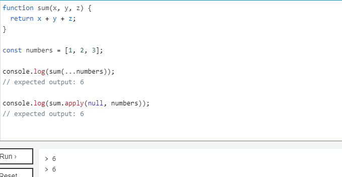
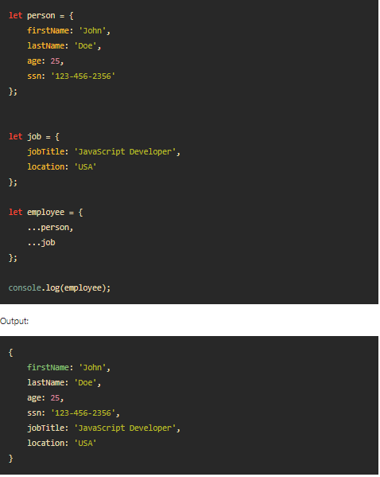

#  Passing Functions as Props

## Things I want to know more about

## Lists and Keys

### 1.What does .map() return?

The map() method creates a new array populated with the results of calling a provided function on every element in the calling array.

### 2.If I want to loop through an array and display each value in JSX, how do I do that in React?

The map() method is the most commonly used function to iterate over an array of data in JSX. You can attach the map() method to the array and pass a callback function that gets called for each iteration. When rendering the User component, pass a unique value to the key prop

### 3.Each list item needs a unique ____. 
'Each child in a list should have a unique "key" prop' warning always appears.

### 4.What is the purpose of a key?
keys() is a built-in JavaScript method that returns an array of the given object's property names in the same order as we get with a standard loop. The Object. keys() method takes an object as an argument and returns the array of strings representing all the enumerable properties of a given object.

--------------------------------------------------
## The Spread Operator

### 1.What is the spread operator?
The spread operator is a new addition to the set of operators in JavaScript ES6. It takes in an iterable (e.g an array) and expands it into individual elements. The spread operator is commonly used to make shallow copies of JS objects. Using this operator makes the code concise and enhances its readability.

### 2.List 4 things that the spread operator can do.
- Copying an array.
- Concatenating or combining arrays.
- Using Math functions.
- Using an array as arguments.
- Adding an item to a list.
- Adding to state in React.
- Combining objects.
- Converting NodeList to an array.

### 3.Give an example of using the spread operator to combine two arrays.
`let fruits = ["apples", "bananas"];`

`let vegetables = ["corn", "carrots"];`

`let produce = [...fruits, ...vegetables];`
`//["apples","bananas","corn","carrots"]`

### 4.Give an example of using the spread operator to add a new item to an array.

### 5.Give an example of using the spread operator to combine two objects into one.

