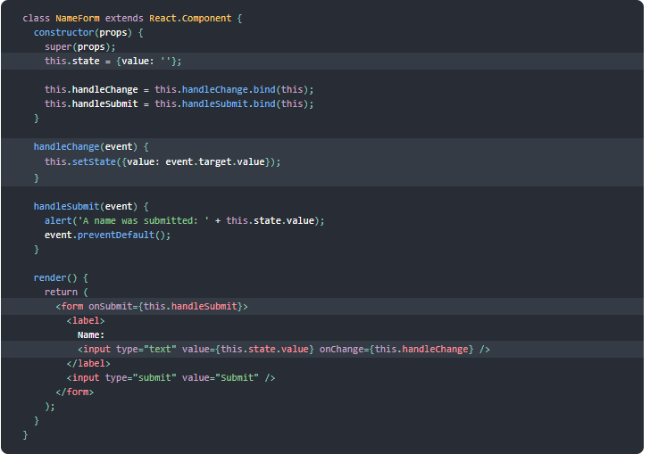
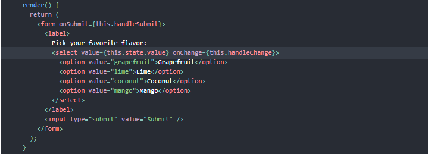

# React and Forms
## Things I want to know more about:
## 1-Forms:

### Controlled Components

- In React, mutable state is typically kept in the state property of components, and only updated with setState().

We can combine the two by making the React state be the “single source of truth”. Then the React component that renders a form also controls what happens in that form on subsequent user input. An input form element whose value is controlled by React in this way is called a “controlled component”.

Since the value attribute is set on our form element, the displayed value will always be this.state.value, making the React state the source of truth. Since handleChange runs on every keystroke to update the React state, the displayed value will update as the user types.

### The textarea Tag:

In React, a `<textarea>` uses a value attribute instead. This way, a form using a `<textarea>` can be written very similarly to a form that uses a single-line input:

`<textarea value={this.state.value} onChange={this.handleChange} />`

### The select Tag:

Note that the Coconut option is initially selected, because of the selected attribute. React, instead of using this selected attribute, uses a value attribute on the root select tag. This is more convenient in a controlled component because you only need to update it in one place. For example:

----------------------------------------------------

## 2-The Conditional (Ternary) Operator Explained

A ternary operator allows you to assign one value to the variable if the condition is true, and another value if the condition is false. ... A ternary operator makes the assignment of a value to a variable easier to see, because it's contained on a single line instead of an if else block.

### Why would we use a ternary operator?

The JavaScript ternary operator is a useful tool that you'll encounter in code quite often. Ternary operators can make statements more concise and easy to reason about. If the syntax is new to you, the operator may seem a little confusing.

